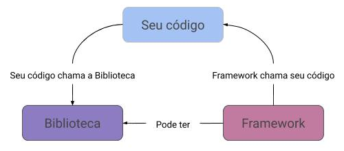
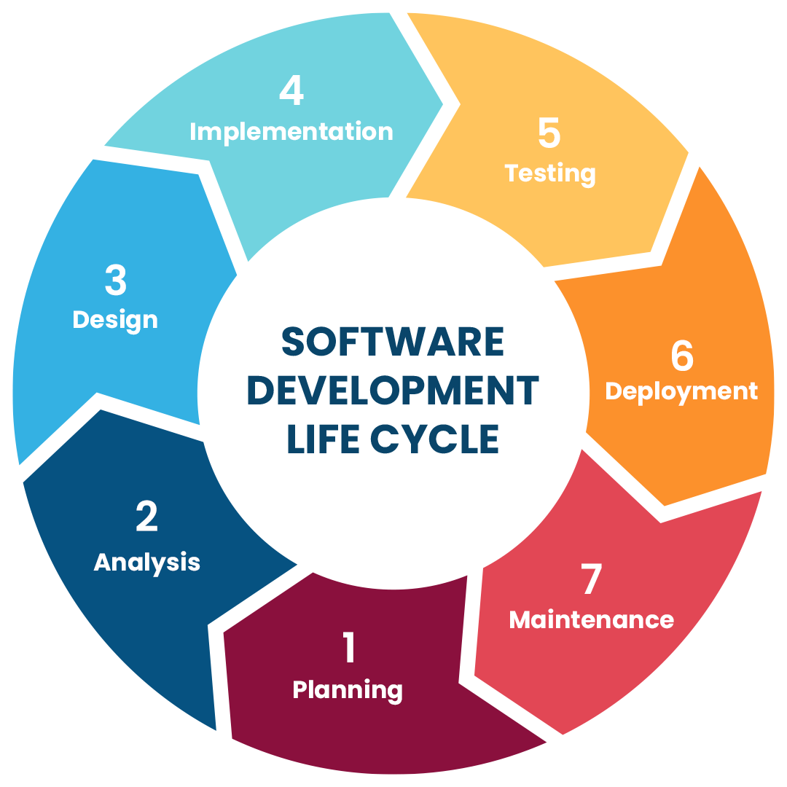
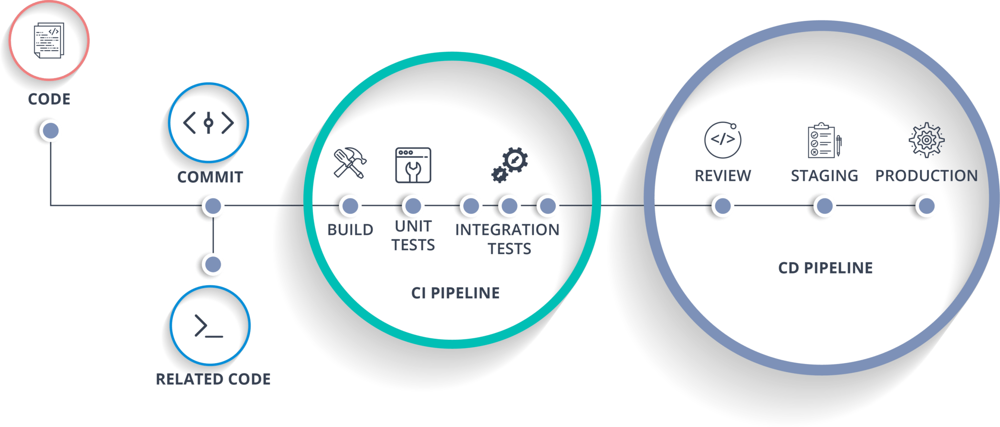

<!-- theme uncover -->

<!-- _class: invert -->
# Frameworks Full Stack
## Desenvolvimento Full-Stack
### Conceitos Básicos

---

**Backend**: refere-se à <mark>parte de um sistema ou aplicação que lida com a lógica de negócios, processamento de dados e interação com bancos de dados</mark>, sendo responsável por gerenciar a comunicação entre o servidor e o cliente. Ele não é visível para os usuários finais, mas é essencial para o funcionamento de aplicações web e móveis. O backend é geralmente desenvolvido usando linguagens de programação como Python, Java, Ruby ou PHP, e envolve a criação de APIs, gerenciamento de servidores e segurança de dados.

**Frontend**: refere-se à parte de uma aplicação ou site que é visível e interativa para os usuários. É a <mark>interface do usuário, onde as pessoas interagem com o conteúdo e as funcionalidades da aplicação</mark>. O desenvolvimento frontend envolve o uso de linguagens como HTML, CSS e JavaScript para criar layouts, design e comportamento dinâmico das páginas. Os desenvolvedores frontend se concentram em garantir que a experiência do usuário seja intuitiva e atraente, otimizando a usabilidade e a estética. 

---

**Full-stack**: refere-se a um desenvolvedor ou profissional que <mark>possui habilidades e conhecimentos tanto no frontend quanto no backend de uma aplicação</mark>. Isso significa que um desenvolvedor full-stack é capaz de trabalhar em todas as camadas de uma aplicação, desde a interface do usuário até a lógica de negócios e o gerenciamento de banco de dados. Esses profissionais têm uma compreensão abrangente das tecnologias e ferramentas necessárias para construir uma aplicação completa

---

**Biblioteca**: é um conjunto de códigos, funções e rotinas reutilizáveis que facilitam a execução de tarefas específicas em programação, permitindo que os desenvolvedores economizem tempo e esforço ao evitar a necessidade de escrever código do zero. As bibliotecas <mark>oferecem uma coleção de funcionalidades que podem ser integradas em projetos, proporcionando soluções para problemas comuns</mark>.

**Framework**: é uma estrutura de software que fornece um conjunto de ferramentas, bibliotecas e convenções para facilitar o desenvolvimento de aplicações. Ele <mark>estabelece uma *base imposta* sobre a qual os desenvolvedores podem construir, tendo funcionalidades pré-definidas</mark>. Impõe regras e convenções que os desenvolvedores devem seguir. 

---
### Bibliotecas vs. Framework
Quando usamos uma **biblioteca**, <mark>nosso código é quem controla o fluxo</mark>: chamamos as funções ou recursos da biblioteca quando precisamos. Já com um **framework**, acontece o oposto: <mark>ele define a estrutura e o fluxo principal do programa e chama o nosso código em momentos específicos</mark>, como em eventos ou callbacks. Um framework pode, inclusive, usar bibliotecas internamente, mas a principal diferença está em quem controla a execução.

---

SDLC: ou ciclo de vida de desenvolvimento de software (_Software Development Life Cycle_)  é um <mark>processo estruturado que orienta o desenvolvimento de software</mark>, abrangendo desde a concepção até a entrega e manutenção do produto. 

---

O SDLC é composto por várias fases:
- **Planejamento** – definição de objetivos, requisitos e escopo do software.
+ **Análise de Requisitos** – levantamento detalhado das necessidades do usuário e do sistema.
+ **Design (Projeto)** – criação da arquitetura e especificações técnicas do software.
+ **Desenvolvimento** – codificação e construção do sistema de acordo com o design.
+ **Testes** – verificação e validação para garantir que o software funciona conforme o esperado.
+ **Implantação** – disponibilização do software em ambiente de produção.
+ **Manutenção** – correção de falhas, atualizações e melhorias contínuas após a entrega.

---

**DevOps**: é uma abordagem que integra desenvolvimento de software (Dev) e operações de TI (Ops) para criar um processo contínuo e colaborativo de construção, testes, implantação e monitoramento de aplicações. Seu objetivo é reduzir o tempo entre o desenvolvimento e a entrega ao usuário, promovendo automação (como integração e entrega contínuas – CI/CD), ciclos curtos de atualização e colaboração entre equipes, garantindo que o software seja entregue de forma mais rápida, estável e com melhorias constantes.

**Ciclo DevOps**: mais moderno e ligado ao desenvolvimento ágil, é um processo contínuo que integra todas as etapas do desenvolvimento e operação de software — planejamento, codificação, construção, testes, liberação, implantação, operação e monitoramento — em um fluxo repetitivo e automatizado.

---

**Integração Contínua (CI)**: é uma prática de desenvolvimento de software na qual <mark>o código criado por diferentes desenvolvedores é *integrado* frequentemente em um repositório compartilhado</mark>, onde processos automatizados de compilação e testes verificam se tudo funciona corretamente.

**Entrega Contínua (CD)**: é uma prática de desenvolvimento que estende a Integração Contínua, garantindo que <mark>o software esteja sempre em um estado *pronto para implantação* em produção<mark>. A cada alteração validada, o código passa por processos automatizados de build, testes e empacotamento, resultando em versões que podem ser entregues rapidamente aos usuários.

---

# Obrigado 👋
## 👋 Professor Giovani Bontempo
giovani.bontempo@faculdadeimpacta.com.br